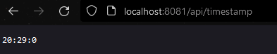

# Table of Contents

1. [Homework](#homework)
2. [Homework Explanation](#homework-explanation)
   1. [User service](#user-service)
        1. [User model](#user-model)
        2. [Skill model](#skill-model)
        3. [UserSkill model](#userskill-model)
    2. [Timestamp service](#timestamp-service)
3. [Docker part](#docker-part)
    1. [Build and run Timestamp service](#build-and-run-timestamp-service)
    2. [Build and run User service](#build-and-run-user-service)
    3. [Create network](#create-network)
4. [Docker compose](#docker-compose)
5. [Analyze result](#analyze-result)

# Homework

In this task we must create two service. Then we must pack each application into docker. At the end we should pack both of them into one docker-compose.

# Homework Explanation

In order to do this homework I have created following services:

<ol>
    <li>User</li>
    <li>Timestamp</li>
</ol>

## User service

In the <b>User</b> service I have following endpoints:

<ol>
    <li><b>/api/users</b> - returns all users</li>
    <li><b>/api/skills</b> - returns all skills</li>
    <li><b>/api/users/:id</b> - returns specific user</li>
    <li><b>/api/users/:id/skills/:id</b> - create relation between user and skill</li>
</ol>

Also I have 3 models:

#### User model

```css
    public int Id { get; set; }
    public string Name { get; set; }
    public string Surname { get; set; }
    public ICollection<UserSkill> UserSkills { get; set; }
```

#### Skill model

```css
    public int Id { get; set; }
    public string Name { get; set; }
    public ICollection<UserSkill> UserSkills { get; set; }
```

#### UserSkill model

```css
    public int Id { get; set; }
    public int SkillId { get; set; }
    public Skill Skill { get; set; }
    public int UserId { get; set; }
    public User User { get; set; }
```

I have many to many relationship between <b>User</b> and <b>Skill</b>. So, <b>UserSkill</b> model is used to handle this.

## Timestamp service
In the <b>Timestamp</b> service I get current time with the help of the following controller:
```bash
/api/timestamp
```
<hr/>
<b>**Note</b> User and Timestamp services run on 8080 and 8081 ports, respectively.
<hr/>

# Docker part
## Build and run Timestamp service
First I have build my Timestamp service:
<br/>
<p align="center">
  
</p>
<br/>
Then I have run this service:
<p align="center">
  
</p>

## Build and run User service
First I have build my User service:
<br/>
<p align="center">
  
</p>
<br/>
Then I have run this service:
<p align="center">
  
</p>
<hr/>

## Create network
Then I have created network and connected both services to this network:
<p align="center">
  
</p>
<p align="center">
  
</p>
<p align="center">
  
</p>
<p align="center">
  
</p>

# Docker Compose
<p align="center">
  
</p>

# Analyze result
When we run Timestamp service we get following result:
<p align="center">
  
</p>
When we run User service we get following result:
<p align="center">
  
</p>
<p align="center">
  
</p>
<br>
If we close the Timestamp service in User service we will get following result:
<p align="center">
  
</p>

